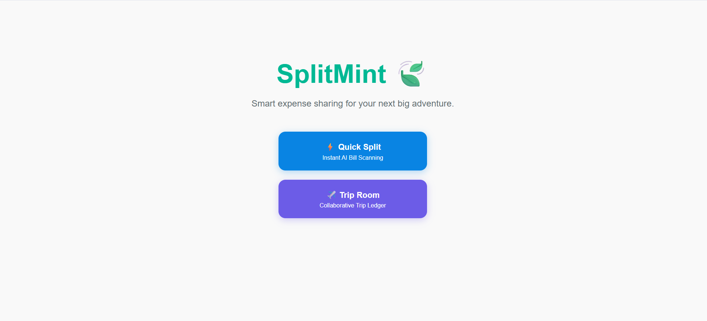
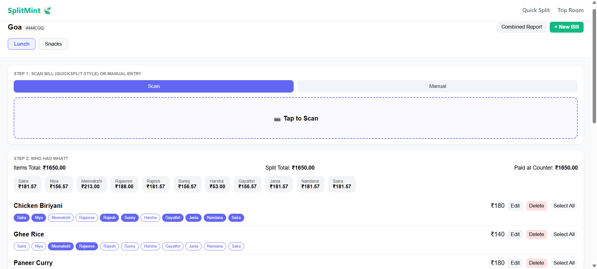
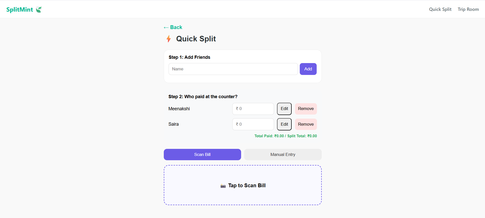

[SplitMInt] 🎯

Basic Details
Team Name: [Coffee_Codes]
Team Members
Member 1: [Saira Zac Rozan] - [Muthoot Institute of Technology and Science]
Member 2: [Meenakshi T S] - [Muthoot Institute of Technology and Science]

Hosted Project Link
[https://splitmint-lilac.vercel.app/]

Project Description
[SplitMint is a receipt-centric expense manager designed for group trips. It allows users to create dynamic "Bill Sheets" for every payment, using AI to scan receipts and a quantity-based splitting algorithm to ensure everyone pays exactly for what they consumed.]

The Problem statement
[During group trips, traditional "equal split" apps fail when people order different items at a restaurant or share specific costs. Manual calculation is tedious and prone to errors.]

The Solution
[We built a "Google Sheets" style interface where each bill is a new tab. Users can:

Add new "Bill Sheets" for every trip expense (e.g., Dinner, Jeep Rent).

Manually enter items and prices for each bill.

Assign items to specific friends by tapping their names (Quantity-Based Splitting).

View an optimized settlement plan to clear all debts in the fewest possible transactions.]

Technical Details
Technologies/Components Used
For Software:

Languages used: [JavaScript(React)]
Frameworks used: [React (UI Framework).]
Libraries used: [Firebase SDK, qrcode.react,React Router]
Tools used: [V S Code, Git, GitHub, Firebase Console]
For Hardware:

Features
List the key features of your project:

Feature 1: [Dynamic Bill Sheets: Create unlimited "tabs" for different expenses within a single trip room.]
Feature 2: [Quantity-Based Logic: Ensure users only pay for what they specifically consumed.]
Feature 3: [Real-time Collaboration: Changes made on one device (like a laptop) appear instantly on mobile devices via Firebase.]
Feature 4: [UPI Integration: Generate payment QR codes automatically for easier settlements.]
Implementation
For Software:
Installation
[npm install]
Run
[npm start]

Project Documentation
For Software:
Screenshots (Add at least 3)
](The SplitMint entry point, offering two modes: Quick Split for instant scanning and Trip Room for long-term group travel tracking)

](A functional look at the Expense card featuring the interactive '+ Add' button used to log new costs manually.) 

](AA functional look of the Quick Split Interface) 

Additional Demos
[https://drive.google.com/file/d/16to_4wTZcZD_XJf3qwWYqZmnhdWF9lF1/view?usp=drive_link]

AI Tools Used AI Tools Used
Tool Used: Gemini

Purpose: * Assistance in debugging complex React state management and Firebase synchronization.

Generation of optimized algorithms for transaction minimization and quantity-based cost splitting.

Troubleshooting Firebase deployment and document reference errors.

Key Prompts Used:

"Fix FirebaseError: Invalid document reference. Document references must have an even number of segments, but rooms has 1."

"Develop a React function to toggle individual participants for specific items in a shared bill sheet."

"How to deploy a React app to GitHub Pages using the terminal and gh-pages package."

Percentage of AI-generated code: Approximately 60%

Human Contributions:

Architecture Design: Planning the multi-bill "Google Sheets" structure for trip management.

Business Logic: Defining the rules for how counter payments interact with individual item splits.

Integration & Deployment: Setting up the Firebase environment, managing security rules, and executing the GitHub deployment.

UI/UX Decisions: Designing the mobile-first layouts and the visual hierarchy for trip rooms.

Team Contributions
[Saira Zac Rozan]: [UI/UX Development: Built the mobile-first React interface for the Home, Quick Split, and Trip Room screens.

Manual Input System: Developed the manual item-entry components for adding bill details without scanning.

Interactive Splitting: Implemented the button-tag logic that allows users to toggle their names for quantity-based cost assignment.

Documentation & QA: Managed the technical README and tested real-time Firebase synchronization across devices.]
[Meenakshi T S]: [Backend & Database Architecture: Designed and implemented the Firebase Firestore NoSQL schema for real-time trip synchronization.

Settlement Algorithm: Developed the core logic for Quantity-Based Splitting and transaction minimization to optimize debt clearing.

System Integration: Managed the connection between the React frontend and the cloud database, including fixing critical document reference errors.

Payment Integration: Integrated the qrcode.react library to automatically generate UPI QR codes for instant settlements.]

